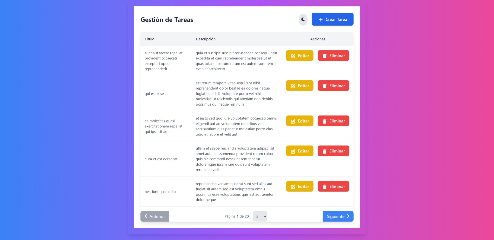
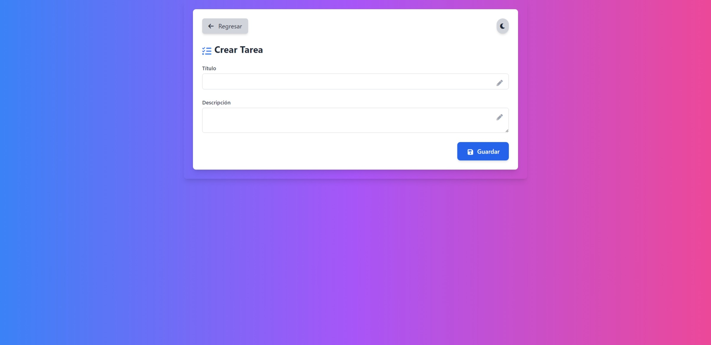
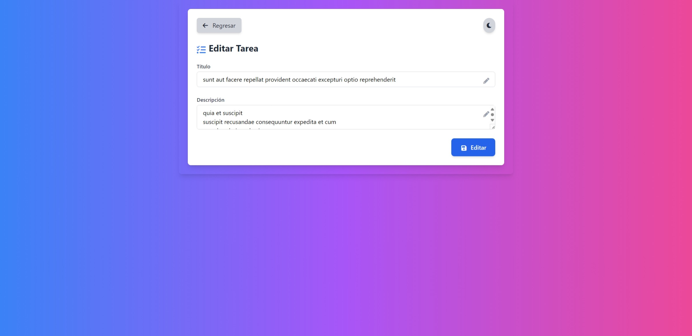

# Aplicación de Gestión de Tareas

Esta es una aplicación web simple para gestionar una lista de tareas, desarrollada con Angular y Tailwindcss.

## Requisitos

- Node.js
- Angular CLI

## Instalación

1. Clonar el repositorio:
   ```bash
   git clone <URL_DEL_REPOSITORIO>
   cd <NOMBRE_DEL_REPOSITORIO>
   ```

2. Instalar las dependencias:
   ```bash
   npm install
   ```

## Ejecución

1. Iniciar el servidor de desarrollo:
   ```bash
   ng serve
   ```

2. Abrir el navegador y navegar a `http://localhost:4200`.

## Características

- Añadir, editar y eliminar tareas.
- Validaciones de formulario.
- Paginación en la lista de tareas.
- Integración con una API pública para obtener tareas.
- Lazy Loading para módulos de Angular.

## Capturas de Pantalla





## Code scaffolding

Angular CLI includes powerful code scaffolding tools. To generate a new component, run:

```bash
ng generate component component-name
```

For a complete list of available schematics (such as `components`, `directives`, or `pipes`), run:

```bash
ng generate --help
```

## Building

To build the project run:

```bash
ng build
```

This will compile your project and store the build artifacts in the `dist/` directory. By default, the production build optimizes your application for performance and speed.

## Running unit tests

To execute unit tests with the [Karma](https://karma-runner.github.io) test runner, use the following command:

```bash
ng test
```

## Additional Resources

For more information on using the Angular CLI, including detailed command references, visit the [Angular CLI Overview and Command Reference](https://angular.dev/tools/cli) page.
